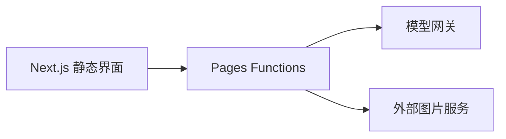

<div align="center">

# Mirage Studio · 幻境制造机

液态玻璃风格的 AI 绘画工作空间，连接提示词、模型与生成结果。


[本地运行](#本地运行) · [源码导航](#源码导航) · [配置与安全](#配置与安全) · [验证](#验证)

</div>

当前实现采用 Next.js 静态导出与 Cloudflare Pages Functions，不是原 AI Studio README 所暗示的单一 Gemini 模板。界面经 `/api/proxy` 调用模型网关，并包含图片上传与读取接口。

## 本地运行

准备与 [package.json](./package.json) 依赖兼容的 Node.js/npm。

```sh
git clone https://github.com/alanbulan/MIRAGE-STUDIO-x-LIQUID-GLASS.git
cd MIRAGE-STUDIO-x-LIQUID-GLASS
npm ci
npm run dev
```

`npm run dev` 只启动 Next.js 开发环境，不能单独承载 `functions/` 中的 Cloudflare API。验证完整页面/API组合时，将 `.dev.vars.example` 复制为 `.dev.vars`，在本机填写自己的 `CUSTOM_API_KEY`，再运行：

```sh
npm run preview
```

现有 preview 脚本先构建，再执行 `wrangler pages dev out`，同时提供静态资源与 Pages Functions。访问终端打印的地址，不要继续把请求发给只启动了前端的端口。

即使运行在本机，配置了密钥的生成请求仍会访问真实上游并可能计费；上传图片也可能发送到第三方。不要用真实私人图片测试公共上传链路。

## 源码导航

| 入口 | 职责 |
| --- | --- |
| [app/page.tsx](./app/page.tsx) | 工作台与页面编排 |
| [GeneratorView](./components/features/GeneratorView.tsx) | 生成配置与结果界面 |
| [ImageEditorModal](./components/features/ImageEditorModal.tsx) | 图片编辑交互 |
| [liquid-glass](./components/ui/liquid-glass.tsx) | 液态玻璃风格组件 |
| [api-client](./lib/api-client.ts) | 模型目录、图片生成、上传和响应解析 |
| [proxy](./functions/api/proxy/%5B%5Bpath%5D%5D.ts) | 上游模型 API 转发 |
| [upload](./functions/api/upload.ts)、[image](./functions/api/image.ts) | 第三方上传与图片读取 |
| [wrangler.toml](./wrangler.toml) | Pages 配置 |



## 配置与安全

模型代理读取服务端 `CUSTOM_API_KEY`。本地放在受忽略的 `.dev.vars`；线上通过对应环境的 Secret 配置。不要使用 `NEXT_PUBLIC_` 前缀把密钥暴露给浏览器，也不要提交真实配置。

缺少或只含空白的 `CUSTOM_API_KEY` 会返回 **HTTP 503**，不再回退到代码中的固定密钥。更新到此版本后，之前依赖默认值的环境需要显式配置 Secret。旧值是否仍有效未验证；若曾作为真实凭据使用，应在服务方撤销或轮换，删除当前代码不清除 Git 历史。

当前上游网关和上传服务地址仍在源码中固定配置，必须检查它们是否属于自己或获得授权。此改动没有增加用户鉴权、限流、上传隐私保护或完整 URL 访问控制；公开部署前仍需完成这些审查，不能仅凭密钥移出代码就认为服务已安全。

原 `.env.example` 属于旧 AI Studio 模板，不能代替 Pages Functions 的 Secret 配置。模型下拉列表和元数据中的能力描述不是上游当前可用模型清单。

## 验证

代理的最小回归测试使用 Node.js 原生测试运行器，不访问网络、不需要真实密钥。在支持 TypeScript 类型剥离的 Node.js 环境中运行（本次使用 22.16.0）：

```sh
node --experimental-strip-types --test tests/proxy.test.mjs
```

覆盖缺失/空白密钥、预检、方法限制、GET/POST 转发、上游错误和无效 JSON。本次只验证代理边界，没有重新执行完整前端构建或真实图片生成。

`next.config.ts` 中构建会跳过 ESLint，因此 `npm run build` 成功不等于 lint 通过。`npm run deploy` 会真正发布到 Cloudflare，不能当作本地测试；本次没有执行部署命令。

参考：[Pages 本地开发](https://developers.cloudflare.com/pages/functions/local-development/)。原文与来源可从 Git 历史追溯，现有许可证和署名不变。
